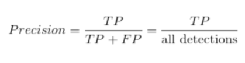

# CS 4641: Face Mask Detection

Contributors: Tushna Eduljee, Kenneth Kanampully, Nesha Prabahar, Deepti Vaidyanathan

## Project Goal

COVID-19 has truly changed the world and has forced everyone to rethink how we operate our day to day lives. From working from home to social distancing, life in 2020 is very different from life in 2019. One of these major changes is the introduction of masks as a public health measure to reduce the spread of this disease. However, a lot of citizens have pushed against mask mandates and will not comply with policies of business by not wearing their mask. This causes a public health risk and a hassle for business owners who have to ensure that all of the customers are wearing a mask. To combat this issue, it would be very helpful to have an automated way to detect the people who do not wear masks in these enclosed spaces.

## Project Overview

In order to gain a better idea of this area of research and development, and ensure that our project would be building upon what was already in the field, we decided to conduct some background research. We found projects that have worked to classify different types of masks on an individual (one person in the frame and they are wearing a mask), such as cloth and surgical. Although this project also has useful applications in prevention and preventative care, we decided that we would want to cater our project towards an object detection task in order to change the target audience. While prior projects often feature the user of masks themselves as the user of the model, our model has applications in the enterprise world. We aim to perform an object detection task in our project, such that our model draws bounding boxes around those in an image who are not wearing a mask.

In the development of our model, we have decided to use unsupervised learning for the data processing pipeline and supervised learning for the model itself. Since our project deals with high volumes of image data, our model will require quite a bit of processing power in order to train. For this reason, we have used principal component analysis (PCA) in order to reduce the image dimensionality and feature space, before the image is fed into our ML model. This allows the model to have a much more condensed and less sparse image, thereby training less feature weights, and enabling our model to not only run faster but also be less likely to overfit as our dataset is on the smaller side for an object detection task.

For the model selection task, we conducted thorough research on YOLO, Faster RCNN, RFCN, and SSD, in order to gauge which would be more fitting for our particular object detection task. One particular Google research paper informed much of our decisions on the different use cases and specs of these architectures. We will likely be choosing Faster RCNN for our project, as it maintains very high accuracy with some sacrifices for speed. For our purposes, this works well as our model is going to be running locally rather than on embedded device and we don’t currently have plans of running an MVP in real time.

## Dataset

The dataset that we found would be most suitable for our needs can be found on kaggle as the Face Mask Detection dataset. One key aim of our model is that it can identify many people in a crowd and subsequently whether or not they are wearing a mask. For this reason, this dataset of people in crowds is perfect for our needs. As our model is a supervised learning model, it was also important that the dataset be pre-labeled with important needed information. The labels that come with this dataset include labels for people wearing masks, those not wearing them, and those them improperly. As each image features more than one person, it cannot have a raw label, as there may be a mix of people wearing their masks in different ways per image. For this reason, this dataset also contains the bounding box labels for the people in the images along with the appropriate labels for each box (one of three classes of labels). The bounding boxes are in PASCAL VOC format.

[Here is the link to the kaggle dataset](https://www.kaggle.com/andrewmvd/face-mask-detection)

*Example Images:*

## Data Cleaning Procedures

#### Cleaning Bounding Box XML Files

The first step in our data cleaning efforts includes converting the xml files (one per image) into tabular data frame format so that it could be used for preprocessing purposes. This consisted of having an individual column for each possible bounding box in an image. Although this leads to a somewhat sparse array, we manage this by reducing outliers as well as using the numpy special representation for sparse arrays.

*Tabular Data:*

#### Removing a Classification from the Dataset

For our model, we really only require class one (wearing a mask) or class two (not wearing a mask). For this reason, we are removing the bounding box labels which belong to class three (wearing a mask, but improperly). This is because those images vary widely from wearing a mask slightly improperly to barely wearing a mask. As there was too much ambiguity, we decided to remove that category altogether and focus our model on wearing or not wearing a mask. This results in a case of skewed classes, but we prefer the case of people being labelled with a mask to without, in case our model is deployed in the real world. This is because resources of locating the person in a business establishment should be saved for those truly not wearing a mask and not those half-wearing a mask. 81% of our labelled bounding boxes are with masks, and all other labels are without masks - showing the skewed classes.

*Example Image of incorrectly wearing a mask:*

#### Removing Outliers

The final stage in our data cleaning procedure was removing extreme outliers from the dataset so that we can reduce our feature space from 120 columns to 40 columns. An outlier for our purposes is an image with an abnormally large amount of bounding boxes associated with it. This would be an outlier because from a data processing standpoint, there would be no need to increase the dimensionality of the data being processed by ten fold just for the sake of a few images from the entire bunch having many faces detected. The identification of such outliers was done based on the number of bounding boxes per image and the box plot of that data. We do not get rid of all outliers, however, as there is a significant enough portion to include in our dataset so that we can show an accurate representation of different sized crowds. Additionally, this removal of outliers further decreases the dataset which is already on the smaller side. This cleaning reduces it by 7 images.

*Box Plot including Outliers:*

*Box Plot not including Outliers:*

#### Creating a new Dataframe

While training and testing the model, we found out early on that the precision recall of "without_masks" was very low. In order to increase the precision recall, we brainstormed ways to increase the dataset. We found that including the outliers could help with our problem, but we did not want to have a high dimensionality. Therefore, we decided to restructure our dataframe so that instead of each row being an image, each row is a bounding box. This allowed us to keep the outliers, increasing the size of our dataset, and greatly helped in implementing the Faster R-CNN model later on.

*The New Dataframe Layout:*

#### Data Augmentation

Because we originally reduced the dataset size by removing a classification and extreme outliers, we wanted to increase the dataset. We attempted to use rotation and reflection in order to augment the images early on. However, we were having trouble matching up the bounding boxes to the newly augmented data. Durin gour midterm report, were were advised that while data augmentation is useful, it is not vital to training the model. This advice coupled with the new bounding-box based data frame that allowed for extreme outliers led us to scrapping the data augmention.

*Example of a rotational augmentation:*

## Data Preprocessing

#### Padding

For the data preprocessing stage we first decided to standardize image sizes by adding padding to the bottom and left edges of each image so that it increased the overall image size to 600x600. This effectively became the maximum x and y for all images in dataset. Although increasing the representation of each image effectively means storing more data, and therefore performing more computation, it also means that we do not have to crop images and therefore edit any bounding box information. Once we complete our model, we plan on looking into further performance improvements such as scaling the image in order to reduce the need for padding.

#### Principal Component Analysis (PCA)

By standardizing image size, we have also increased the amount of information that will be passed into our data pipeline, and therefore it is necessary that we take measures to reduce the dimensionality of our images. To this end, we have decided to use principal component analysis (PCA) for image compression. PCA is a form of unsupervised learning which uses variance and covariance of a dataset in order to take linear combinations of the data and reduce the overall dimensionality without resulting in much data loss (depending on hyperparameter tuning of k based on percentage of variance retained). We can use it on our images to blend less significant edges that may be revealed by the convolutional layers with other edges in order to reduce the the runtime and energy towards filtering the insignificant aspects of the image. In order to determine the optimal number of components to keep, we plotted a graph of the percentage of variance to retain (as seen below).

*Image Before PCA and with Bounding Box:*

*Image after PCA:*

*Variance:*

Based on the figure above, we settled the number of principle components to 18 since it is the lowest number of components where we reliably retained enough of the variance.

## Faster R-CNN

Faster-RCNN is an object detection architecture based on the paper written by Ren et al. in January 2016. It builds on Fast-RCNN by using a region proposal network to produce regions of an image where an object of interest may potentially exist, and passes those regions to Fast-RCNN in order to detect the objects in them. It is faster and more efficient than it’s previous iterations because the RPN tells the detector where to look. 

#### Region Proposal Network

The RPN is a convolutional neural network that helps us identify and size regions of interest within the image. The premise is to use uniform anchor points to calculate regions that most closely intersect with our ground-truth bounding boxes in order to produce regions of interest. We used the pretrained VGG-16 classifier to extract feature maps of the image and pass it to 2 1x1 convolutional classifier layer and regression layer, where we consider anchors with an Intersection-over-Union value with the ground-truth bounding boxes greater than or equal to 0.5 to be a part of the “foreground” with the rest being “background” regions. We chose this value specifically because we wanted to be consistent with the hyperparameters used within the original Faster-RCNN paper. We finally apply non-maximum suppression in order to make sure that we do not have any overlapping regions of interest. 

#### Region of Interest Pooling and Classification

The output of the RPN layer feeds into ROI pooling, which is then classified as with or without masks to the pooled ROIs. In addition, they go through a regression layer in order to size the bounding boxes of the now classified regions of the image.

#### Training and Testing

We had a skewed dataset with 3232 bounding boxes labeled as ‘without_mask’ and only 717 labeled as ‘with_mask.’ However, by representing our data as a row per bounding box, it allowed us to be able to maintain the distribution of the labels across the training and test datasets. We split our data with 70% in training and 30% in test.

## Results

After training over 25 epochs, we calculated the average Intersection-over-Union with the ground-truth bounding boxes based on our detector’s predictions. IoU is calculated by the following equation:
IoU = Area of Overlap/Area of Union

The IoU for both labels are represented below:
**With_mask**: 0.7314
**Without_mask**: 0.6089

We put the values of the precision-recall curves for each label and in both the training and test datasets since it is resistant to skewed datasets in table format below:

## Discussion

IoU between predicted region of interest and ground-truth bounding box represents how well our predicted bounding boxes match up with the ground truth. We evaluated this for those predicted bounding boxes and corresponding labels and averaged the results between common labels. The results indicate fairly accurate bounding box generation, with the higher IoU for the with_mask label most likely due to the dataset’s skewed distribution.

*IoU Equation*

*Precision Equation*

*Recall Equation*

#### Future Work

The original labeled images of the dataset included bunding boxes for those who were wearing masks incorrectly, which could be useful to detect for our purpose of determining which people in a crowd are not following COVID-related health guidelines. We would also look into larger datasets that contain a wider variety of people and masks in order to make our model more robust to various situations. Faster-RCNN is only one object detection architecture of many, and it would be useful to compare the performance of our model to others like YOLOv5 and SSD trained on the same dataset. After performance comparisons on single-frame image data, we could see how well it works for detecting over multiple frames as well as evaluating the best frame rate to apply the detector in order gather data on mask wearing in real time.

## References
1. “Face Mask Detection System Using AI: AI Mask Detection.” Software Development Company, www.leewayhertz.com/face-mask-detection-system/. 
2. “Faster R-CNN: ML.” GeeksforGeeks, 1 Mar. 2020, www.geeksforgeeks.org/faster-r-cnn-ml/. 
3. Gandhi, Rohith. “R-CNN, Fast R-CNN, Faster R-CNN, YOLO - Object Detection Algorithms.” Medium, Towards Data Science, 9 July 2018, towardsdatascience.com/r-cnn-fast-r-cnn-faster-r-cnn-yolo-object-detection-algorithms-36d53571365e. 
4. Jaadi, Zakaria. “A Step by Step Explanation of Principal Component Analysis.” Built In, builtin.com/data-science/step-step-explanation-principal-component-analysis. 
5. Katz, Josh, et al. “A Detailed Map of Who Is Wearing Masks in the U.S.” The New York Times, The New York Times, 17 July 2020, www.nytimes.com/interactive/2020/07/17/upshot/coronavirus-face-mask-map.html. 
6. Koech, Kiprono Elijah. “On Object Detection Metrics With Worked Example.” Medium, Towards Data Science, 10 Sept. 2020, towardsdatascience.com/on-object-detection-metrics-with-worked-example-216f173ed31e. 
7. Ren, Shaoqing, et al. “Faster R-CNN: Towards Real-Time Object Detection with Region Proposal Networks.” ArXiv.org, 6 Jan. 2016, arxiv.org/abs/1506.01497. 
8. Rosebrock, Adrian. “Intersection over Union (IoU) for Object Detection.” PyImageSearch, 18 Apr. 2020, www.pyimagesearch.com/2016/11/07/intersection-over-union-iou-for-object-detection/. 
9. Sigmind. “Masked Face Detection In the Wild Dataset.” Kaggle, 19 June 2020, www.kaggle.com/sigmind/masked-face-detection-wider-dataset?select=COVID-mask-detection_WIDER.tar.xz. 
10. Babu, Gandham Vignesh. “Metrics on Object Detection.” Medium, Medium, 22 Jan. 2020, medium.com/@vignesh943628/metrics-on-object-detection-b9fe3f1bac59. 
